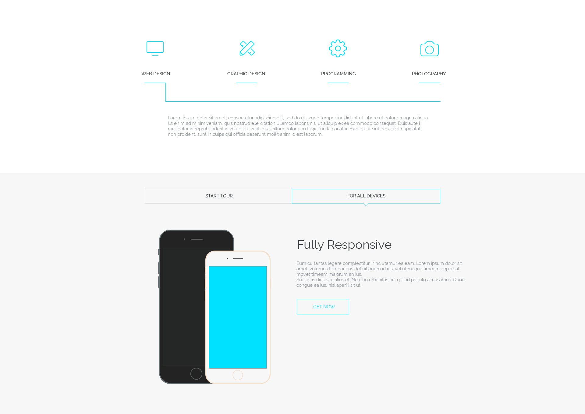

##Задача 
* Создание сайта-портфолио веб-студии по предоставленному psd макету. 

##Общие требования к сайту 
* Корректное отображение сайта на следующих разрешениях экрана: 320px, 687px, 992px, 1200 px 
* Поддержка браузеров: последние версии Chrome, Firefox, Safarі, Opera, MS Edge. 
* Для реализации функционала сайта используйте AngularJS. 

##Структура сайта: 
###Header
  

* Меню дожно быть зафиксировано в верхней части экрана, чтобы пользователь мог им всегда воспользоватся. 
* При нажатии на каждый элемент меню страница плавно прокручивается до соответствующего блока на странице. 
* При нажатии на кнопку start tour страница плавно прокручивается до блока портфолио.  
* Для реализации плавной прокрутки страницы напишите свой сервис AngularJS. 

###Блок с описанием сервисов
 

* При наведении курсора мыши на иконки сервисов, они плавно увеличиваются в размере на 10% и уменьшаются обратно, 
  когда курсор уходит с элемента(для решения задачи используйте директиву AngularJS). 
* При нажатии на кнопку get now страница плавно прокручивается до блока контактов. 

###Блок портфолио 

* Добавьте произвольные изображения в портфолио. 
* Реализуйте фильтрацию изображений по категориям(для решения задачи создайте фильтр AngularJS). 

* Создайте слайдер изображений.
* Смена слайдов происходит вручную при нажатии стрелок навигации. 
* При нажатии на кнопку + выполняется переход в режим просмотра изображений:  

 

* В режиме просмотра изображений навигация по слайдам происходит как с помощью кнопок навигации, так и с помощью клавиатуры. 
* При клике по изображению выполняется выход из режима просмотра изображений. 

###Блок со статистикой достижений 

* Когда блок только появился в видимой области страницы, течении 3 секунд происходит отсчет от 0 до значений, указанных в макете.
* Для решения задачи используйте директиву AngularJS. 

###Блок about us 

* Добавьте произвольное фото для членов команды. 
* При наведении мыши на иконки ссылок социальных сетей они меняют цвет: 

* Реализуйте блок с помощью директивы. 

###Блок отзывов

* Создайте слайдер на 5 слайдов. 
* Смена слайдов должна присходить с интервалом в 3с. 
* При нажатии на кнопку пауза смена слайдов должна приостанавливаться. При повторном нажатии - возобновляться. 

###Блок новостей 

* Загрузите описание новостей из JSON-файла(файл data.json в папке project). 
* Для отображения новостей на странице используйте директиву ng-repeat. 
* При нажатии на текст read more открывается новое окно с текстом новости. 

###Блок контактов 

* Форма с полями Name, Email, Message. Валидация формы происходит при нажатии на клавиши. При вводе пользователем некорректных данных в поле ввода под этим полем сразу отображается сообщение об ошибке. Сообщение об ошибке сразу же скрывается, если пользователь ввел корректные данные. 
* В поле Name допускаются только буквы английского алфавита.
* В поле Email допускаются толко буквы английского алфавита, цифры, знак подчеркивание и симвом @. 
* В поле Message допускаются любые символы. Минимальная длина слообщения - 20 символов. 

###Footer
 

* Копирайт и кнопка вврех. 
* При нажатии на кнопку страница плавно прокручивается в начало. 

