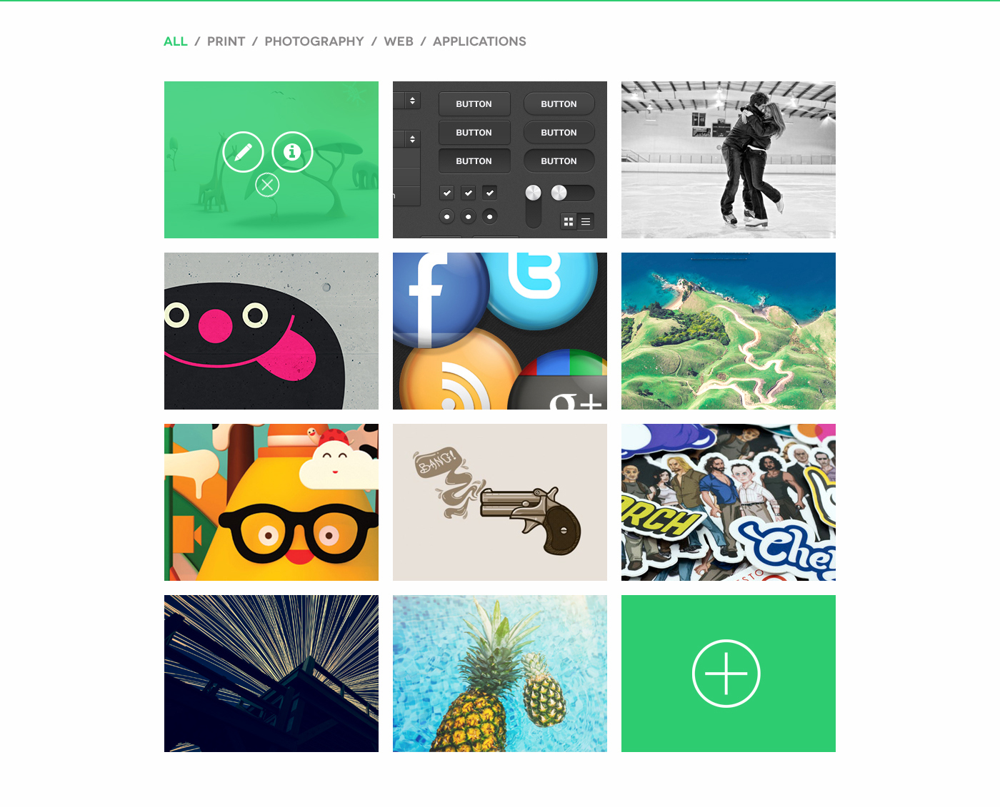
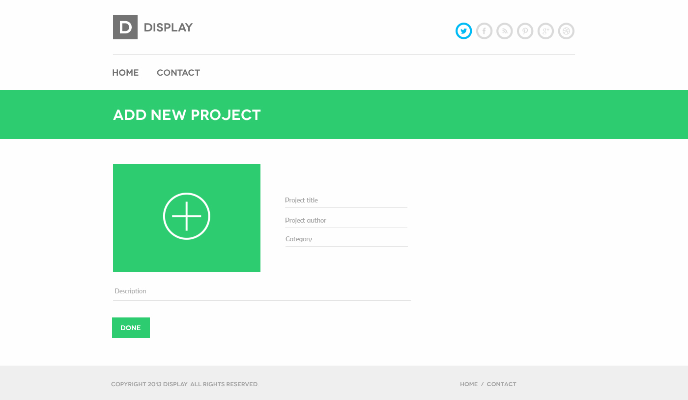
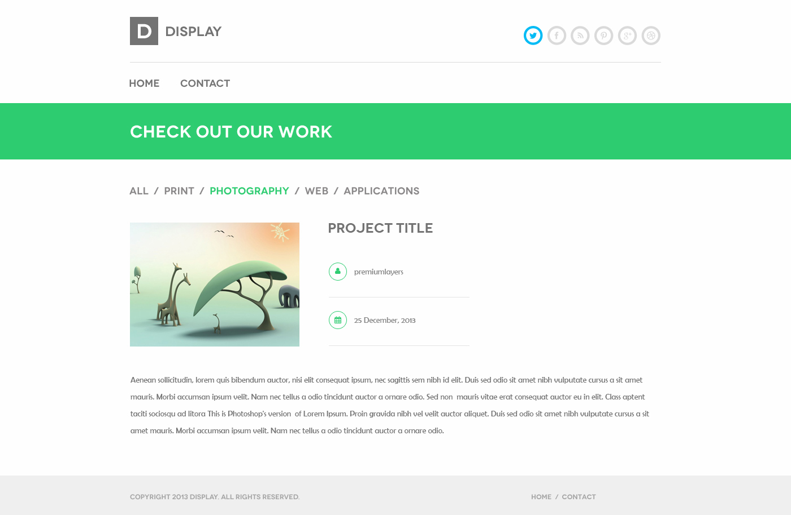
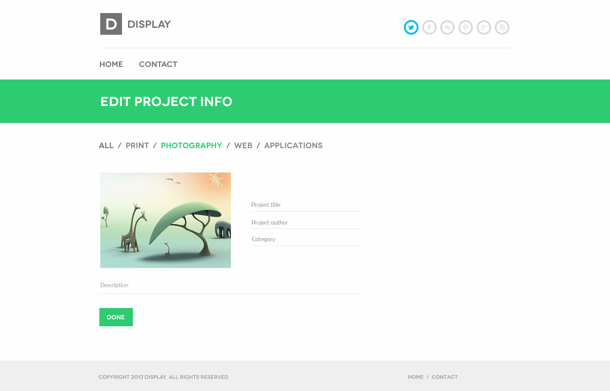
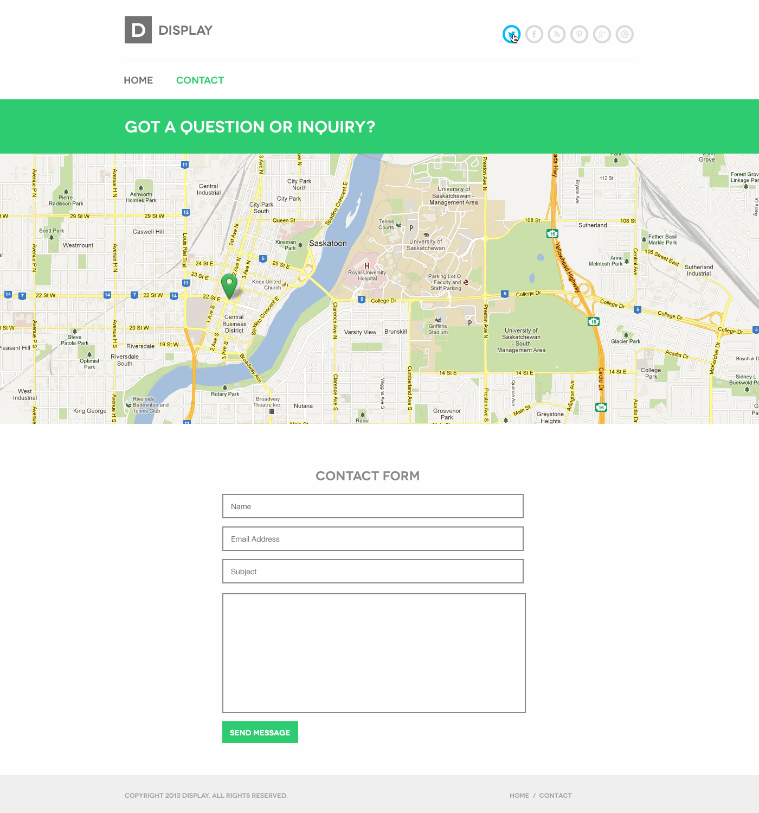

# Задача 

* Создание сайта-портфолио по предоставленному psd макету. 

# Общие задачи

* Корректное отображение сайта на следующих разрешениях экрана: 320px, 687px, 992px, 1200 px 
* Поддержка браузеров: последние версии Chrome, Firefox, Safarі, Opera, MS Edge. 
* Для решения поставленных задач используйте NodeJS и фреймворк Express. 

* Реализуйте сохранение сессий (используйте модули express-session и express-mysql-session). 
* Для сохранения сессий используйте таблицу sessions базы данных data (база данных находится в папке project - файл data.sql). 

# Структура сайта: 

## Домашняя страница 

### Header 

 

* При переходе по пути '/' происходит редирект по пути '/home' и отображается доманяя страница. 
* Реализуйте навигацию с помощью маршрутизации. Т.е. при нажатии на пункт меню(Home / Contact) выполняется переход по соответствующему пути ('/home', '/contact'). 

* Форма авторизации пользователя с полями username и password. 
* При нажатии на кнопку log in (в случае, если поля username и password не пусты) отправляется POST-запрос по пути '/login'. 

* Если значение поля username - 'admin' и поля password - '12345', авторизация пользователя проходит успешно. 
* При успешной авторизации имя пользователя сохраняется как свойство объекта сессии (например, req.session.username). 
* Если значения полей username и password указаны неверно, на экран выводится сообщение об ошибке. 

### Блок портфолио

 

Фильтр категорий: 

* При нажатии на название категории (web, photography и.т.д) выполняется запрос к базе данных data, таблице projects и выбираются элементы с соответствующим значением в колонке category. 
* Элементы, загруженные из базы данных, отображаются на странице. 
* База данных находится в папке project (файл data.sql).   

* По умолчанию (при первоначальной загрузке страницы) на странице отображаются все элементы таблицы projects базы данных data. 

### Важно: для корректного отображения изображений папка uploads(папка находится рядом с файлом с техническим заданием в папке project) должна находиться в папке с html-страницами сайта. 

* При наведении курсора на изображение над ним появляется полупрозрачный слой с иконками (см. макет). 

* Если пользователь не авторизован, при клике по иконкам редактирования(иконка с карандашом) или удаления(иконка со знаком 'закрыть') сервер отвечает статус-кодом 401(unauthorized), а на экран выводится сообщение об ошибке. 
* При клике по иконке информации отправляется GET-запрос '/view/:id', где id - id проекта, по которому кликнул пользователь. Открывается страница просмотра информации о проекте. 
* Если пользователь авторизован, при клике по иконке редактирования проекта отправляется GET-запрос по пути '/edit/:id', где id - id проекта, по которому кликнул пользователь. Открывается страница редактирования информации о проекте. 
* Если пользователь авторизован, при клике по иконке удаления проекта выполняется DELETE-запрос по пути '/delete/:id', где id - id проекта, по которому кликнул пользователь. Проект по указанному в качестве параметра маршрутизации id удаляется из таблицы projects базы данных data. Изменения отображаются на странице. 

* При клике по иконке '+' (в правом нижнем углу на фото) выполняется переход по пути '/new' и отображается страница создания нового проекта. 

* Страницы просмотра, создания и редактирования проектов описаны ниже. 

### Footer 

 

* При нажатии на кнопку 'contact us right now' выполняется переход по пути /contact и отображается страница контактов.  

## Страница создания проекта 

 

* Форма с полями title, author, description, file(в виде иконки с плюсом. Форма имеет атрибут enctype со значением "multipart/form-data".   
* Инструкция по стилизации тега input с атрибутом type="file" [здесь](http://webcodius.ru/recepty-dlya-sajta/stilizaciya-input-file-css-stilizaciya-polya-dlya-zagruzki-fajla.html);   
* При отправке формы выполняется POST-запрос по пути '/upload'. 

* Файл, отправленный вместе с данными формы, загружается в папку uploads, в которой находятся изображения проектов. 
* Инструкция находится [здесь](../project/instructions/readme.md). 

* Выполняется запрос к базе данных data, таблице projects. В базу данных добавляется новый элемент. 
* Значения полей title, author, category, description берутся из данных POST-запроса. 
* В поле date записывается текущая дата в формате yyyy-mm-dd. 
* В поле src записывается путь к файлу с изображением, которое было загружено на сервер в формате 'uploads/file_name.ext', где file_name - имя файла, ext - расширение файла. 

* После выполнения запроса выполняется редирект на главную страницу сайта. 

## Страница просмотра информации о проекте 

 

* На странице отображается информация о проекте, по которому кликнул пользователь на странице home. 

## Страница редактирования проекта 

 

* Форма с полями Title, Author, Category, Description. Валидация формы происходит на стороне клиента. 
* При нажатии на кнопку 'done' выполняется PUT HTTP запрос по пути update/:id, где id - id редактируемого проекта. 
* При обработке PUT запроса по пути 'update/:id', выполняется запрос к таблице projects базы данных data. Обновляются данные элемента по id редактируемого проекта. Значение id считывается из параметров маршрутизации. 

 
 
## Страница контактов 

 

* Форма с полями Name, Email, Subject и Message. 
* В поле Name допускаются только буквы английского алфавита.
* В поле Email допускаются толко буквы английского алфавита, цифры, знак подчеркивание и симвом @. 
* В поле Subject допускаются только буквы английского алфавита.
* В поле Message допускаются любые символы. Минимальная длина сообщения - 20 символов. 

* При нажатии на кнопку 'Send message' выполняется POST-запрос по пути '/contact'. 
* При обработке запроса данные формы сохраняются в формате json в файл data.json (файл создается, если его не существует). 
* Для обработки данных формы используйте модуль [body-parser]('https://www.npmjs.com/package/body-parser'). 

